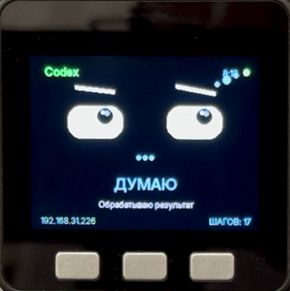
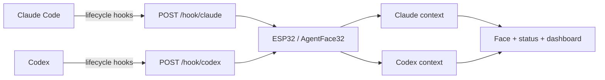

# AgentFace32

**A small ESP32 desk display that gives Claude Code and Codex a face.**

<p align="center">
  
  
  
  
  
</p>

<p align="center">
  
</p>

<p align="center">
  <strong>Real hardware demo on M5Stack Basic — AgentFace32 following a live Codex session.</strong><br>
  <a href="docs/images/agentface32-demo.mp4">Watch the full-quality MP4 demo</a>
</p>

AgentFace32 sits on your desk and reacts to what your coding agents are doing. It reads lifecycle hooks from **Claude Code** and **Codex**, then turns them into an expressive face, a status line, the current file or command, task time, tool count, alerts, and optional sound.

It is deliberately simple: **the AI does not run on the ESP32**. Your agent stays on your computer. The device receives small JSON events over your local network and renders them. No cloud service, account, API key, database, or companion daemon is required.

[Русская документация](README_RU.md)

## Why this exists

Coding agents are useful, but long-running agent sessions are easy to lose track of. You switch windows, answer a message, look back five minutes later and wonder: is the agent still reading, running tests, waiting for permission, or already finished?

AgentFace32 gives that background activity a physical presence. A glance at the desk is enough.

## Features

- **Claude Code + Codex at the same time.** Each agent keeps its own state, task timer, tool count, last result and current detail.
- **Four views:** Claude, Codex, both agents, or **AUTO** to follow whichever agent was active most recently.
- **Expressive states:** idle, online, reading, thinking, editing, running commands, needs attention, done, error, cancelled and sleep.
- **Useful details:** file paths, grep/search patterns, URLs, shell commands, task duration and number of tool calls.
- **Background alerts:** if the hidden agent needs attention or finishes, the active screen can show it without losing the other agent's state.
- **Smarter Codex permissions:** `PermissionRequest` waits 10 seconds before alerting. Auto-approved actions normally continue before that, preventing noisy false alarms.
- **English and Russian UI.** Set one line in `config.local.h`.
- **Optional sound:** M5Stack Basic speech/tone cues, passive piezo tones, or a MAX98357A I²S amp profile.
- **Local REST API:** use AgentFace32 from another agent, editor, script or CI system with a single HTTP POST.
- **Multiple hardware profiles** from one PlatformIO project.

## Supported hardware

| PlatformIO environment | Hardware | Display | Audio | Status |
| --- | --- | --- | --- | --- |
| `m5stack-basic` | M5Stack Basic / Core ESP32 | built-in 320×240 TFT | built-in speaker | **Field-tested** |
| `esp32dev-ssd1306` | ESP32 DevKit | SSD1306 0.96″ 128×64 I²C | optional piezo | validation pending |
| `esp32dev-ssd1306-max98357` | ESP32 DevKit | SSD1306 128×64 I²C | MAX98357A + speaker | validation pending |
| `esp32dev-sh1106` | ESP32 DevKit | SH1106 1.3″ 128×64 I²C | optional piezo | validation pending |
| `esp32s3-ssd1306` | ESP32-S3 DevKitC-1 | SSD1306 128×64 I²C | optional piezo | validation pending |
| `lilygo-t-display` | LILYGO TTGO T-Display | built-in ST7789 240×135 | none by default | validation pending |
| `esp32dev-st7789` | ESP32 DevKit | generic ST7789 240×240 SPI | optional piezo | validation pending |

The M5Stack Basic profile is the reference hardware and has been exercised on a real device. The other profiles are implemented as build targets around inexpensive, common ESP32 parts; they still need first-pass CI and community hardware validation. GitHub Actions is configured to build every profile on each push/PR.

See [Hardware & wiring](docs/HARDWARE.md).

## Quick start

### 1. Install PlatformIO

Use either the [PlatformIO IDE extension](https://platformio.org/install/ide?install=vscode) for VS Code or PlatformIO Core.

### 2. Create your local config

Copy the example file:

```bash
cp include/config.example.h include/config.local.h
```

On Windows PowerShell:

```powershell
Copy-Item include/config.example.h include/config.local.h
```

Edit at least:

```cpp
#define WIFI_SSID "MyWiFi"
#define WIFI_PASSWORD "change-me"
#define UI_LANGUAGE "en"   // or "ru"
```

`config.local.h` is gitignored, so Wi-Fi credentials stay out of the repository.

### 3. Choose a hardware profile and flash

M5Stack Basic:

```bash
pio run -e m5stack-basic -t upload
```

ESP32 DevKit + SSD1306:

```bash
pio run -e esp32dev-ssd1306 -t upload
```

Or select the matching environment in PlatformIO and press **Upload**.

When the device joins Wi-Fi, check Serial Monitor or the display for its IP address. Then verify:

```bash
curl http://DEVICE_IP/health
```

### 4. Connect your agents

- **Claude Code:** [setup guide](docs/CLAUDE_CODE.md) · [ready-to-copy settings](integrations/claude-code/settings.example.json)
- **Codex:** [setup guide](docs/CODEX.md) · [ready-to-copy hooks](integrations/codex/hooks.example.json)

Both agents can report to the same ESP32 simultaneously.

## What the screen shows

A normal single-agent view includes the agent name, face, state, detail and live task time. For example:

```text
Claude                         2:17

             (•   •)
               ...

             THINKING
         src/auth/service.py
```

The **Both** view keeps Claude and Codex visible together. **AUTO** follows whichever agent most recently produced a real event.

On M5Stack Basic:

- **A** — sound on/off
- **B** — cycle demo expressions
- **C** — Claude → Codex → Both
- **hold C** — toggle AUTO

Generic profiles can use the same controls with optional active-low external buttons, or switch views through `POST /view`.

## How it works



Claude Code can send supported lifecycle events directly as HTTP hooks. Codex command hooks pipe their JSON input to `curl`, which forwards it to the ESP32. The firmware normalizes both event streams into the same internal states.

## REST API

The hooks are just HTTP. You can drive the device yourself:

```bash
curl -X POST "http://DEVICE_IP/anim?agent=claude&name=thinking"
curl -X POST "http://DEVICE_IP/anim?agent=codex&name=done"
curl -X POST "http://DEVICE_IP/view?mode=both"
curl "http://DEVICE_IP/state"
```

First-class routes:

```text
POST /hook/claude
POST /hook/codex
POST /hook                 # Claude-compatible alias
POST /anim?agent=...&name=...
POST /view?mode=claude|codex|both|auto
GET  /health
GET  /state
```

See [API reference](docs/API.md).

## Audio

Audio is optional. The visual companion works without a speaker.

- **M5Stack Basic:** short local Russian speech clips when `UI_LANGUAGE` is `ru`; event tones in English mode.
- **Piezo profile:** distinct event tones.
- **MAX98357A profile:** simple I²S event tones through an external speaker.

The M5 speaker path is shut down after playback to reduce idle hiss. Speech is intentionally short because tiny built-in speakers are much clearer with brief phrases than sentences.

## Project structure

```text
include/                 configuration and interfaces
src/                     agent logic + display/audio backends
integrations/claude-code ready hook settings
integrations/codex       ready hook settings
docs/                    hardware, API, integrations, troubleshooting
tools/                   API/demo scripts
.github/workflows/       build matrix for all hardware profiles
```

Display backends are selected at compile time:

- `face_m5.cpp` — M5Stack/M5GFX rich UI
- `face_oled.cpp` — U8g2 128×64 SSD1306/SH1106 UI
- `face_tft.cpp` — TFT_eSPI color ST7789 UI

Adding another ESP32 board usually means adding a hardware profile and one PlatformIO environment rather than forking the application logic. See [Adding hardware](docs/ADDING_HARDWARE.md).

## Build every profile

```bash
pio run -e m5stack-basic
pio run -e esp32dev-ssd1306
pio run -e esp32dev-ssd1306-max98357
pio run -e esp32dev-sh1106
pio run -e esp32s3-ssd1306
pio run -e lilygo-t-display
pio run -e esp32dev-st7789
```

CI runs the same matrix on GitHub.

## Documentation

- [Hardware & wiring](docs/HARDWARE.md)
- [Claude Code setup](docs/CLAUDE_CODE.md)
- [Codex setup](docs/CODEX.md)
- [HTTP API](docs/API.md)
- [Architecture](docs/ARCHITECTURE.md)
- [Troubleshooting](docs/TROUBLESHOOTING.md)
- [Add a new board/display](docs/ADDING_HARDWARE.md)
- [Demo/video checklist](docs/MEDIA.md)
- [Contributing](CONTRIBUTING.md)

## Security and privacy

AgentFace32 has no cloud backend and does not need your AI provider credentials. Hook payloads can contain local file names, shell commands and other development metadata, so keep the device on a trusted LAN. The current HTTP API is intentionally lightweight and unauthenticated; **do not expose port 80 to the public internet**. See [SECURITY.md](SECURITY.md).

## Credits

The original idea was inspired by [Tiny Engineer](https://github.com/jamro/tiny-engineer): give a coding agent a physical presence using lifecycle hooks and a tiny HTTP API. AgentFace32 takes that idea in a display-first, multi-agent direction and uses its own firmware/hardware-profile architecture.

Built with [M5Unified](https://github.com/m5stack/M5Unified), [U8g2](https://github.com/olikraus/u8g2), [TFT_eSPI](https://github.com/Bodmer/TFT_eSPI) and [ArduinoJson](https://arduinojson.org/). See [THIRD_PARTY_NOTICES.md](THIRD_PARTY_NOTICES.md).

## License

MIT — see [LICENSE](LICENSE).

Claude is a trademark of Anthropic. Codex and OpenAI are trademarks of OpenAI. M5Stack, ESP32, LILYGO and other product names belong to their respective owners. AgentFace32 is an independent community project and is not affiliated with or endorsed by those companies.
